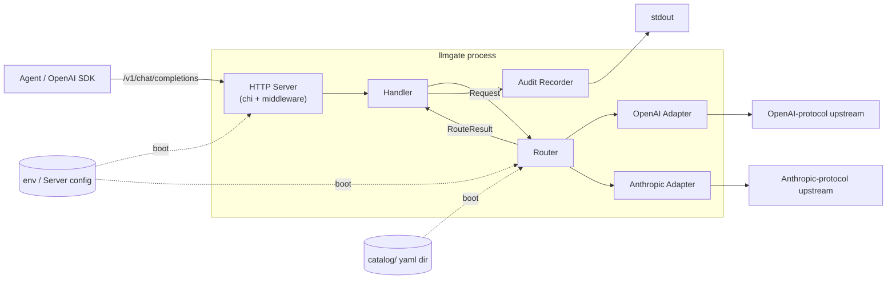
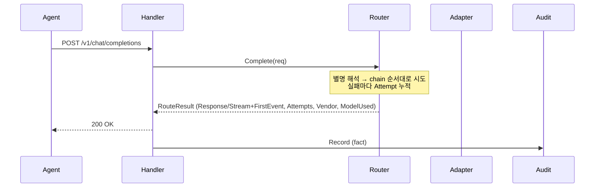

# Architecture

## 정체성

OpenAI SDK 와이어 호환 게이트웨이. 모델은 *기본 등록 단위*, **별명**이 *실제 제어 단위*다. 별명 하나가 chain 으로 풀리고 chain 을 따라 자동 폴백한다. DB 없음, fact 만 발행, 비용 / 한도 계산은 후처리 시스템 책임. 자세한 동기는 `docs/adr/001-identity.md`.

## 코드 구조

```
catalog/                     데이터 (운영자 영역, 코드 0줄)
  models/<id>.yaml           id + vendor + protocol + base_url + auth_env + auth_scheme
  aliases/<name>.yaml        호출 단위 = chain
internal/catalog/            yaml → Catalog struct 로더 (strict 파싱)
internal/config/             env → Server 설정 (서버 + 라우터 정책)
internal/provider/           Provider 어댑터 계약 + 공통 타입 + Stream 그레이스 (정책 0줄)
  └─ openai/                 OpenAI 와이어 어댑터
  └─ anthropic/              Anthropic 와이어 어댑터 (응답을 OpenAI 와이어로 정규화)
internal/router/             별명 → chain 해석, 폴백 시도, 회로 차단 (breaker.go 분리)
internal/server/             chi + middleware + handler + sseWriter + errors
internal/audit/              Recorder 인터페이스 + LogRecorder (stdout)
cmd/llmgate/                 wiring + shutdown
docs/adr/                    Accepted 결정 기록
```

데이터 / 정책 / 코드가 세 자리에 산다. yaml 은 운영자가 손대는 운영 데이터, env 는 인프라 / 시크릿, 코드는 알고리즘. ADR 002 가 이 분리의 근거를 적었다.

## 컴포넌트 구성



| 컴포넌트 | 역할 |
|---|---|
| HTTP Server | chi 라우터 + request_id / access log / recoverer / 요청 타임아웃 미들웨어. `/v1/chat/completions`, `/healthz` 노출 |
| Handler | 요청 디코드, stream/non-stream 분기, RouteResult (Response 또는 Stream + FirstEvent) 와 Stream.Summary 로 audit Record 조립 |
| Router | 별명 → chain 해석, 폴백 시도, 회로 차단. 정책은 부팅 시 env 에서 받는다 |
| OpenAI Adapter | OpenAI 와이어로 upstream 호출 |
| Anthropic Adapter | Anthropic 와이어로 변환 후 호출, OpenAI 와이어로 응답 정규화 |
| Audit Recorder | 요청당 1 개 fact record 발행 (stdout / 향후 이벤트 파이프라인 등) |

## 카탈로그 모양

```
catalog/
  models/<id>.yaml         id / vendor / protocol / base_url / auth_env / auth_scheme
  aliases/<name>.yaml      alias / chain
```

- **모델 yaml** = 모델 1 개 등록. 같은 vendor model name 을 다른 `auth_env` 로 두 yaml 에 두면 catalog 안에서 별개 모델이 된다.
- **별명 yaml** = chain. 클라이언트가 별명으로 부르면 chain 을 순서대로 시도. raw model id 로 부르면 chain 길이 1 → 폴백 발동 자체가 없다. **폴백은 별명 호출에만 의미가 있다.**
- **`description` 등 운영자 메모는 yaml 코멘트** 로 둔다 — 게이트웨이가 데이터로 읽지 않으므로 자유 형식. apiVersion / kind 같은 헤더는 두지 않는다 (ADR 002).
- **strict 파싱** — 모르는 필드 (`type:` / `specs:` / `notes:` 같은 잔재나 오타) 가 있으면 부팅 실패.
- **정책은 yaml 에 없다** — 아래 env 로 받는다.

자세한 결정 근거는 `docs/adr/002-catalog-shape.md`.

### 라우터 / 서버 정책 env

| 변수 | 디폴트 | 의미 |
|---|---|---|
| `LLMGATE_FALLBACK_ON` | `rate_limit,upstream,timeout,network` | 어떤 에러 종류가 chain 을 진행시키는지 |
| `LLMGATE_CIRCUIT_FAILURES` | `3` | 연속 실패 임계 (0 = 비활성) |
| `LLMGATE_CIRCUIT_OPEN_DURATION` | `30s` | 차단 기본 시간 (지수 백오프의 base) |
| `LLMGATE_CIRCUIT_MAX_OPEN_DURATION` | `5m` | 차단 최대 시간 (백오프 cap) |
| `LLMGATE_CIRCUIT_JITTER` | `0.2` | 차단 시간 ±지터 비율 |
| `LLMGATE_REQUEST_TIMEOUT` | `5m` | 요청 1회 총 wall-clock budget |
| `LLMGATE_COMPLETE_TIMEOUT` | `1m` | non-stream 한 시도당 budget |
| `LLMGATE_STREAM_IDLE_TIMEOUT` | `1m` | 스트림 중간 idle (이벤트 사이) 한도 |

### 부팅 순서

1. env → Server config 로드 (addr / shutdown / log level / 라우터 정책)
2. `catalog/` 또는 `LLMGATE_CATALOG=<dir>` 의 yaml 파싱 → models / aliases 확정
3. protocol 별 adapter factory 호출 → 각 모델마다 Adapter 인스턴스 생성 (`auth_env` 도 이때 읽음)
4. Router 조립 (model → adapter 매핑, 별명 chain, 회로 상태 초기화, 정책 주입)
5. Audit Recorder 구성 → Handler / HTTP Server 기동

## 요청 생애주기



스트리밍 요청은 stream 시작 + 첫 이벤트 도착 전 실패에 한해 폴백한다. Router 가 첫 이벤트를 *eager 로* 읽어 `RouteResult.FirstEvent` 에 담아 돌려주므로, Handler 가 200 OK 를 커밋한 시점엔 stream 생존이 이미 검증된 상태. stream 이 열린 뒤의 mid-stream 실패는 partial output 이 이미 전달됐을 수 있어 폴백하지 않는다. end-of-stream 에서 `Stream.Summary()` 로 usage / finish reason 을 audit 에 finalize 한다.

## 상태가 어디 사는가

| 데이터 | 위치 | 수명 |
|---|---|---|
| 모델 / 별명 | `catalog/` (외부 yaml) | 외부 갱신 시 재시작 |
| 라우터 정책 + 서버 런타임 | env → Server config | 프로세스 수명 |
| 회로 차단 상태 | Router 의 breakerStore 메모리 (per-process) | 프로세스 수명 |
| 요청별 시도 이력 | RouteResult → Handler → Record | 요청 1 회 |
| 감사 record | Sink 가 결정 | Sink 정책 |
| 비용 / 한도 / 카탈로그 단가 | **gateway 가 보관하지 않음** | 후처리 시스템 책임 |

## 의도적 미지원

멀티모달 capability 매칭 / `/v1/models` discovery / hot-reload / pre-call 한도 / mid-stream 폴백 / 모델 메타정보(가격 · context window) 보유 / multi-key smart distribution / k8s/CRD 인지 — 모두 V1 범위 밖. 누적 결정은 `docs/adr/003-out-of-scope.md` (작성 예정) 에 정리한다.
