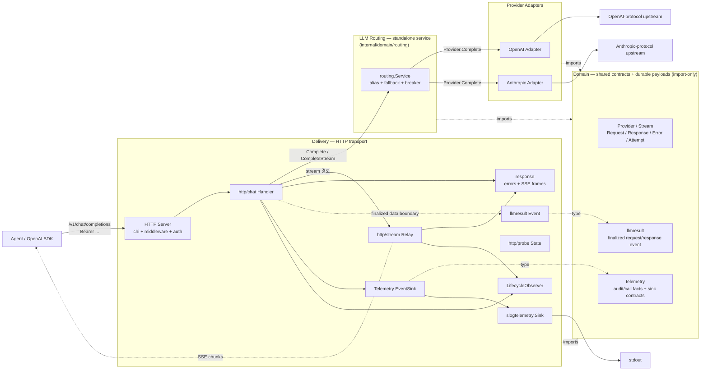

# Architecture

OpenAI SDK 와이어 호환 게이트웨이. 모델은 *기본 등록 단위*, **별명**이 *실제 제어 단위*.
별명 하나가 chain 으로 풀리고 chain 을 따라 자동 폴백한다. DB 없음, fact 만 발행, 비용 /
한도 계산은 후처리 시스템 책임 — 풀-피처 게이트웨이의 운영 면적을 *한 사람 머리에 들어오는
작은 컴포넌트* 로 좁힌 게 정체성. 컴포넌트 책임 분할은 [ADR 001](adr/001-component-boundaries.md).

## 문서 지도

본 페이지는 시스템 지도와 코드 구조만 둔다. 세부 항목은 개념별 자식 문서.

| 문서 | 다루는 것 |
|---|---|
| [data.md](data.md) | catalog / consumers yaml 형태와 검증 정책 |
| [config.md](config.md) | `LLMGATE_*` 환경 변수 |
| [logs.md](logs.md) | access / audit / call 로그 정책 |
| [metrics.md](metrics.md) | Prometheus metric / label 정책 |
| [identity.md](identity.md) | 상태 위치 + 의도적 미지원 (V1 거절 목록) |
| [adr/](adr/) | 서비스 정체성과 주요 경계 결정 |

## 시스템 지도

게이트웨이는 **Delivery / Routing / Providers** 런타임 레이어와, 모두가 import 하는
**Domain** 계약 모듈로 구성된다. 호출 흐름은 Agent → Delivery → Routing → Providers 의
단방향이고, Domain 은 타입 계약 / durable payload import 대상이다.



## 레이어와 의존 방향

| 레이어 | 위치 | 책임 |
|---|---|---|
| Delivery | `internal/platform/http/*` | OpenAI-compatible HTTP wire, auth, response envelope, SSE, probes, access accounting |
| Routing | `internal/domain/routing` | alias → chain 해석, fallback 적격성, circuit breaker |
| Providers | `internal/platform/providers/*` | vendor wire 호출, status 분류, 첫 이벤트 검증, wire 정규화 |
| Domain | `internal/domain/*` | catalog / consumers / llmtypes / telemetry / llmresult 계약 |
| App | `internal/app/gateway` | config 로딩, provider/router/telemetry/server 조립, listen/shutdown |

Routing 이 Delivery 로 돌려주는 형식은 `llmtypes.Stream` / `llmtypes.Response` 이며 HTTP를 모른다.
스트리밍의 first-event boundary 는 시간축에서 드러나는 이 레이어 경계다 ([ADR 004](adr/004-fallback-policy.md)).

| 레이어 | 컴포넌트 | 역할 |
|---|---|---|
| Delivery | HTTP Server | chi 라우터, request id, access log, recoverer, probes, `/metrics` |
| Delivery | http/auth | Bearer 키 sha256 lookup. 실패해도 Handler 까지 보내 audit-always 보장 ([ADR 003](adr/003-consumers.md)) |
| Delivery | http/chat | 요청 decode, stream/non-stream 분기, audit/call finalize, request wall-clock timeout ([ADR 005](adr/005-timeout-authority.md)) |
| Delivery | http/stream | 200 OK 이후 SSE relay, idle timeout, client close, `[DONE]` ([ADR 004](adr/004-fallback-policy.md)) |
| Domain | telemetry | `AuditEvent` / `CallEvent` / `EventSink` / `LifecycleObserver` 계약 |
| Platform | telemetry/slog | audit / call stdout JSON sink |
| Platform | telemetry/prometheus | RED / USE metric recorder |
| Domain | llmresult | 학습/분석용 finalized request/response event schema |
| Domain | llmresult/sink | no-op / panic recovery / bounded async delivery |
| Platform | nats/llmresult | finalized event JetStream publisher |
| Domain | catalog | model / alias yaml 검증과 routing input 로딩 |
| Domain | consumers | consumer yaml 검증, 키 해시 lookup store |
| Routing | routing.Service | alias chain, fallback, circuit breaker, non-stream attempt timeout |
| Providers | OpenAI / Anthropic adapter | vendor protocol 변환과 failure classification |
| App | gateway | 런타임 조립과 graceful shutdown |

각 컴포넌트의 단일 책임 (*권위자가 한 명*) 결정 근거는 [ADR 001](adr/001-component-boundaries.md).

## 런타임 경계

- `AuditEvent` 는 chat 요청마다 1 행 emit 한다. auth 실패, bad request, panic 도 audit 에 남긴다.
- `CallEvent` 는 vendor attempt 가 있었던 요청에만 emit 한다. vendor 호출 전 끝난 요청은 audit 에만 남긴다.
- 스트리밍 폴백은 status open / first event 단계까지만 허용한다. 200 OK 이후 mid-stream 실패는 SSE error frame + `[DONE]` 으로 끝낸다 ([ADR 004](adr/004-fallback-policy.md)).
- `/healthz/live` 는 SIGTERM 뒤에도 200, `/healthz/ready` 와 `/healthz` 는 drain 중 503 이다. `/metrics` 는 probes 처럼 business middleware 밖에 둔다.
- `LLMGATE_SHUTDOWN_DRAIN_TIMEOUT` 이 graceful shutdown 의 상한이다. 오케스트레이터의 grace period 는 이 값보다 크게 잡는다.

## 코드 소유권

패키지 경로는 Go 컴파일 단위보다 먼저 소유권과 시스템 경계를 드러낸다.

```text
internal/domain/     라우팅 규칙, 공통 계약, durable event schema
internal/platform/   HTTP, NATS, Prometheus, upstream network adapter
internal/app/        부팅 조립, provider 생성, shutdown
```

디렉토리 이동 자체는 다이어트가 아니다. 읽는 사람이 봐야 할 범위가 줄거나 잘못된 책임 이름이
사라질 때만 의미 있는 구조 변경으로 본다.
