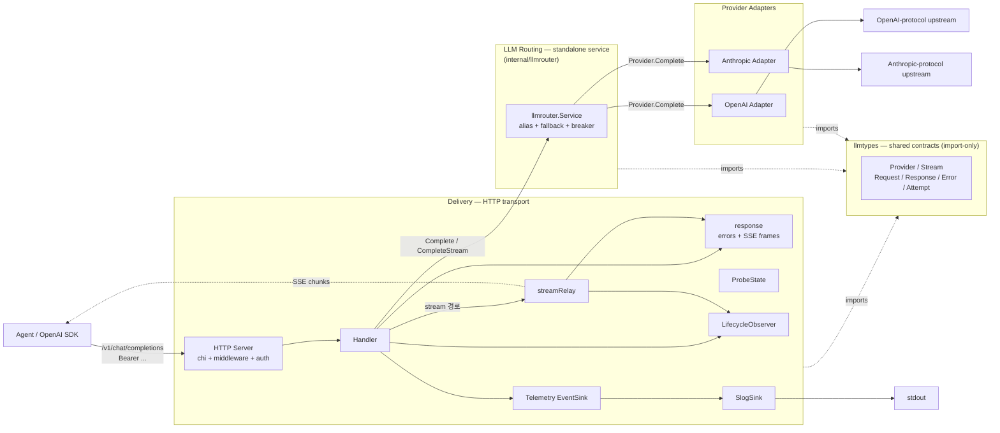

# Architecture

OpenAI SDK 와이어 호환 게이트웨이. 모델은 *기본 등록 단위*, **별명**이 *실제 제어 단위*.
별명 하나가 chain 으로 풀리고 chain 을 따라 자동 폴백한다. DB 없음, fact 만 발행, 비용 /
한도 계산은 후처리 시스템 책임 — 풀-피처 게이트웨이의 운영 면적을 *한 사람 머리에 들어오는
작은 컴포넌트* 로 좁힌 게 정체성. 컴포넌트 책임 분할은 [ADR 001](adr/001-component-boundaries.md).

## 문서 지도

본 페이지는 시스템 지도와 코드 구조만 둔다. 세부 항목은 개념별 자식 문서.

| 문서 | 다루는 것 |
|---|---|
| [data.md](data.md) | catalog / consumers yaml 형태와 검증 정책 |
| [config.md](config.md) | `LLMGATE_*` 환경 변수 |
| [lifecycle.md](lifecycle.md) | 부팅 시퀀스 + 프로브 + 셧다운 / drain |
| [request.md](request.md) | 요청 생애주기 + 스트리밍 폴백 경계 |
| [logs.md](logs.md) | access / audit / call 로그 갈래와 키 스키마 |
| [metrics.md](metrics.md) | Prometheus RED / USE 지표와 라벨 경계 |
| [identity.md](identity.md) | 상태 위치 + 의도적 미지원 (V1 거절 목록) |
| [adr/](adr/) | Accepted 결정 기록 (6개) |

## 시스템 지도

게이트웨이는 **3 개의 런타임 레이어** (Delivery / Routing / Providers) 와 모두가 import 하는
**도메인 계약 모듈** (`llmtypes`) 로 구성된다. 런타임 호출 흐름은 Agent → Delivery → Routing →
Providers 의 단방향이고, `llmtypes` 는 호출 노드가 아니라 *타입 계약 import 대상* 이므로
점선으로만 연결된다.



### 레이어와 의존 방향

- **Delivery** (`internal/server/`) — HTTP 전송 책임. chi + middleware + auth + Handler + streamRelay + response wire helpers + probes + metrics. SSE / `[DONE]` / idle timeout / 401 / readiness 같은 *와이어 시맨틱* 을 책임.
- **Routing** (`internal/llmrouter/`) — *standalone* 서비스. alias → chain 해석, fallback 적격 판정, 회로 차단. stdlib + `llmtypes` 만 import. HTTP 외 frontend (CLI / queue / gRPC) 가 `llmrouter.NewService(models, aliases, ...)` 만 호출하면 그대로 구동.
- **Providers** (`internal/providers/openai|anthropic/`) — `llmtypes.Provider` 구현. vendor 와이어 차이 (status 분류 / 첫 이벤트 검증 / 와이어 정규화) 를 자기 안에 가둠.
- **Contracts** (`internal/llmtypes/`) — Provider / Stream / Request / Response / Error / Attempt — 모든 런타임 레이어가 import 하는 *도메인 계약 모듈*. 런타임 호출 노드가 아니므로 시스템 지도에서 점선 import 로만 표시.
- **boundary**: Routing 이 Delivery 로 돌려주는 형식은 `llmtypes.Stream` (인터페이스) / `llmtypes.Response` (struct). 둘 다 HTTP 모름. ADR 004 의 *first-event boundary* = 시간축에서의 레이어 경계 표현.

| 레이어 | 컴포넌트 | 역할 |
|---|---|---|
| Delivery | HTTP Server | chi 라우터 + request_id / clientContext / access log / recoverer / read+request timeout. `/v1/chat/completions` (auth 보호), `/healthz/live` · `/healthz/ready` · `/healthz` (공개), 선택적 `/metrics` (middleware 밖) |
| Delivery | auth middleware | `Authorization: Bearer` 추출 → sha256 → consumers Store lookup → ctx 에 ConsumerInfo 기록. 실패해도 short-circuit 안 함 — Handler 가 audit-always emit ([ADR 003](adr/003-consumers.md)) |
| Delivery | Handler | 요청 디코드, stream / non-stream 분기. ConsumerInfo 로 `AuditEvent` / `CallEvent` 공통 키를 채움 + auth 실패 시 401. 요청 총 wall-clock 한도의 권위자 ([ADR 005](adr/005-timeout-authority.md)) |
| Delivery | response | OpenAI-style error envelope, Retry-After, SSE frame writer, response status/bytes accounting |
| Delivery | streamRelay | 스트림 열린 뒤 SSE wire transcript. 이벤트 전송, idle timeout, client_closed, mid-stream error, `[DONE]` ([ADR 004](adr/004-fallback-policy.md)). 스트림 idle 한도의 권위자 ([ADR 005](adr/005-timeout-authority.md)) |
| Delivery | ProbeState | SIGTERM 시 `MarkShuttingDown()` → readiness 만 503. liveness · in-flight 영향 없음 |
| Delivery | LifecycleObserver | request / stream 시작·종료 hook. live gauge 같은 관측값용이며 완료된 사실은 telemetry event 로 남김 |
| Delivery | Telemetry EventSink | finalized `AuditEvent` / `CallEvent` delivery boundary. panic isolation 으로 요청 경로와 sink 결함을 분리 |
| Delivery | SlogSink | 기본 sink. audit / call event 를 Loki-friendly stdout JSON 라인으로 라우팅 |
| Routing | llmrouter.Service | 별명 → chain 해석, 폴백 적격 판정, 회로 차단 ([ADR 004](adr/004-fallback-policy.md)). non-stream 시도당 한도의 권위자 ([ADR 005](adr/005-timeout-authority.md)). stdlib + llmtypes 만 import |
| Providers | OpenAI Adapter | OpenAI 와이어 호출. status 분류 + 첫 이벤트 검증 ([ADR 004](adr/004-fallback-policy.md)) |
| Providers | Anthropic Adapter | Anthropic ↔ OpenAI 와이어 양방향 변환 (tools / tool_choice / tool_calls / tool_use). status 분류 + 첫 이벤트 검증 ([ADR 004](adr/004-fallback-policy.md)) |
| Boot data | consumers Store | 부팅 시 yaml → sha256 → consumer 매핑 read-only. 0 개면 부팅 fail ([ADR 003](adr/003-consumers.md)). Delivery 의 auth middleware 가 소비 |

각 컴포넌트의 단일 책임 (*권위자가 한 명*) 결정 근거는 [ADR 001](adr/001-component-boundaries.md).

## 코드 구조

```
catalog/                     vendor 등록 (운영자, 코드 0줄)
  models/<id>.yaml           id + vendor + protocol + base_url + auth_env + auth_scheme
  aliases/<name>.yaml        호출 단위 = chain
consumers/                   호출자 등록 (운영자, 코드 0줄)
  <name>.yaml                name + key_hashes (sha256 only)
internal/catalog/            yaml → Catalog 로더
internal/consumers/          yaml → Store (sha256 → consumer lookup)
internal/config/             env → Server 설정
internal/llmtypes/           공통 계약 + OpenAI-shaped DTO + ErrorKind
internal/providers/          벤더 어댑터
  ├─ openai/                 OpenAI 와이어 어댑터
  └─ anthropic/              Anthropic ↔ OpenAI 와이어 변환
internal/llmrouter/          별명 → chain, 폴백, 회로 (service.go + breaker.go)
internal/streaming/          스트림 시작 검증 + close grace helper
internal/server/             chi + middleware + auth + handler + streamRelay + probes + metrics route
  └─ response/               OpenAI-style errors + SSE frames + response accounting
internal/telemetry/          AuditEvent / CallEvent + EventSink + slog / Prometheus sinks + lifecycle hooks
cmd/llmgate/                 wiring + shutdown
scripts/gen-consumer.sh      호출자 발급 헬퍼
docs/adr/                    Accepted 결정 기록
```
