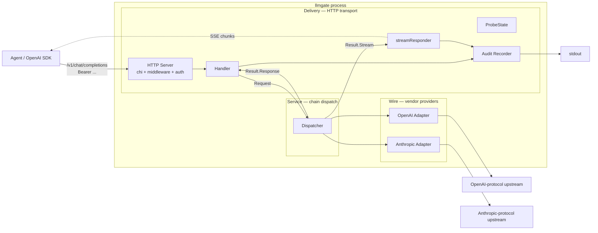
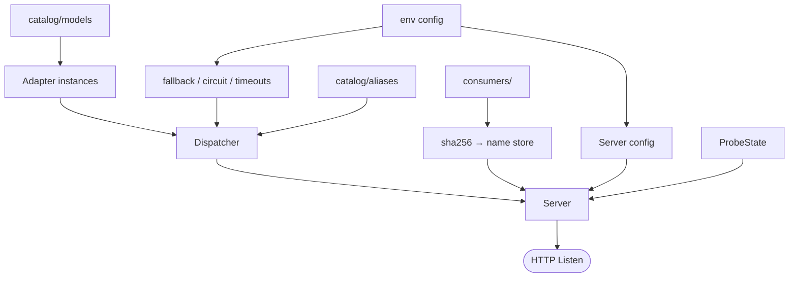
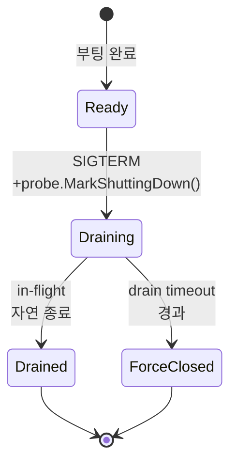
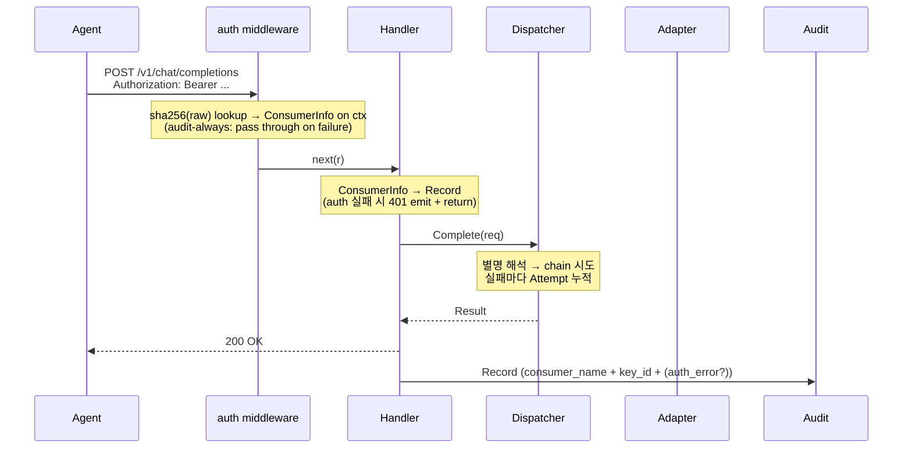

# Architecture

OpenAI SDK 와이어 호환 게이트웨이. 모델은 *기본 등록 단위*, **별명**이 *실제 제어 단위*.
별명 하나가 chain 으로 풀리고 chain 을 따라 자동 폴백한다. DB 없음, fact 만 발행, 비용 /
한도 계산은 후처리 시스템 책임. 정체성 결정 근거는 ADR 001.

## 시스템 지도

게이트웨이는 3 레이어로 쌓여있다. 의존 방향은 **단방향** — Delivery → Service → Wire.
boot data 와 셧다운 흐름은 *별도 다이어그램* (`## 부팅 시퀀스`, `## 프로브 & 셧다운`) 이
담당하므로 이 그림은 *runtime 호출 흐름* 만 보인다.



### 레이어 의존성과 경계

- **Service** (`internal/dispatch/`) — stdlib + `internal/provider/` 만 의존. *standalone* — HTTP 외 frontend (CLI / queue / gRPC) 가 `dispatch.NewDispatcher(models, aliases, ...)` 만 호출하면 chain / 폴백 / 회로 / 시도당 한도 그대로 사용 가능.
- **Delivery** (`internal/server/`) — Service 를 HTTP 로 노출. chi + middleware + auth + Handler + streamResponder + probes + audit. Service 가 모르는 *와이어 시맨틱* (SSE / `[DONE]` / idle timeout / 401 / readiness) 을 책임.
- **Wire** (`internal/provider/openai|anthropic/`) — `provider.Provider` 인터페이스 구현. vendor 와이어 차이 (status 분류 / 첫 이벤트 검증 / 와이어 정규화) 를 자기 안에 가둠.
- **boundary**: Service 가 Delivery 로 돌려주는 형식은 `provider.Stream` (인터페이스) / `provider.Response` (struct). 둘 다 HTTP 모름. ADR 006 의 *first-event boundary* = 시간축에서의 레이어 경계 표현.

| 레이어 | 컴포넌트 | 역할 |
|---|---|---|
| Delivery | HTTP Server | chi 라우터 + request_id / clientContext / access log / recoverer / read+request timeout. `/v1/chat/completions` (auth 보호), `/healthz/live` · `/healthz/ready` · `/healthz` (공개) |
| Delivery | auth middleware | `Authorization: Bearer` 추출 → sha256 → consumers Store lookup → ctx 에 ConsumerInfo 기록. 실패해도 short-circuit 안 함 — Handler 가 audit-always emit (ADR 008) |
| Delivery | Handler | 요청 디코드, stream / non-stream 분기. ConsumerInfo 로 Record 채움 + auth 실패 시 401. 요청 총 wall-clock 한도의 권위자 (ADR 005) |
| Delivery | streamResponder | 스트림 열린 뒤 SSE wire transcript. 이벤트 전송, idle timeout, client_closed, mid-stream error, `[DONE]` (ADR 006). 스트림 idle 한도의 권위자 (ADR 005) |
| Delivery | ProbeState | SIGTERM 시 `MarkShuttingDown()` → readiness 만 503. liveness · in-flight 영향 없음 |
| Delivery | Audit Recorder | 요청당 1 개 fact record. consumer_name + consumer_key_id + auth_error 포함 — *누가 / 왜 실패* 의 사실 |
| Service | Dispatcher | 별명 → chain 해석, 폴백 적격 판정, 회로 차단 (ADR 004). non-stream 시도당 한도의 권위자 (ADR 005). stdlib + provider 만 import |
| Wire | OpenAI Adapter | OpenAI 와이어 호출. status 분류 + 첫 이벤트 검증 (ADR 006) |
| Wire | Anthropic Adapter | Anthropic ↔ OpenAI 와이어 양방향 변환 (tools / tool_choice / tool_calls / tool_use). status 분류 + 첫 이벤트 검증 (ADR 006) |
| Boot data | consumers Store | 부팅 시 yaml → sha256 → consumer 매핑 read-only. 0 개면 부팅 fail (ADR 008). Delivery 의 auth middleware 가 소비 |

각 컴포넌트의 단일 책임 (*권위자가 한 명*) 결정 근거는 ADR 007.

## 코드 구조

```
catalog/                     vendor 등록 (운영자, 코드 0줄)
  models/<id>.yaml           id + vendor + protocol + base_url + auth_env + auth_scheme
  aliases/<name>.yaml        호출 단위 = chain
consumers/                     호출자 등록 (운영자, 코드 0줄)
  <name>.yaml                name + key_hashes (sha256 only)
internal/catalog/            yaml → Catalog 로더
internal/consumers/            yaml → Store (sha256 → consumer lookup)
internal/config/             env → Server 설정
internal/provider/           Adapter 계약 + 공통 타입
  ├─ openai/                 OpenAI 와이어 어댑터
  └─ anthropic/              Anthropic ↔ OpenAI 와이어 변환
internal/dispatch/            별명 → chain, 폴백, 회로 (breaker.go 분리)
internal/server/             chi + middleware + auth + handler + streamResponder + probes
internal/audit/              Recorder + LogRecorder (stdout)
cmd/llmgate/                 wiring + shutdown
scripts/gen-consumer.sh        호출자 발급 헬퍼
docs/adr/                    Accepted 결정 기록
```

## 카탈로그 / 호출자 yaml

```
catalog/                              consumers/
├── models/<id>.yaml                  └── <name>.yaml
│      id + vendor + protocol            name +
│      + base_url + auth_env             key_hashes (sha256:hex64)
│      + auth_scheme                     [raw 키는 디스크 미존재]
└── aliases/<name>.yaml
       alias + chain
```

샘플:

```yaml
# catalog/models/deepseek-v4-flash.yaml
id: deepseek-v4-flash
vendor: opencode
protocol: openai
base_url: https://api.opencode.example/v1
auth_env: LLMGATE_OPENCODE_API_KEY
auth_scheme: bearer
```

```yaml
# catalog/aliases/smart.yaml
alias: smart
chain:
  - kimi-k2.6
  - deepseek-v4-pro
  - deepseek-v4-flash
```

```yaml
# consumers/acme-prod.yaml
name: acme-prod
key_hashes:
  - sha256:0123456789abcdef0123456789abcdef0123456789abcdef0123456789abcdef
```

데이터 / 정책 / 코드가 세 자리에 산다 — yaml = 운영 데이터, env = 인프라·시크릿, 코드 = 알고리즘.
- **catalog**: 별명 호출만 chain 폴백 (raw model id 호출은 chain 길이 1, 폴백 발동 자체 없음). 모르는 필드 → 부팅 fail. 결정 근거 ADR 002.
- **consumers**: `scripts/gen-consumer.sh` 가 raw 키 발급 → sha256 만 yaml 에 박음. multi-key 활성 가능 (회전 윈도우). 부재 / 빈 디렉토리 → 부팅 fail (닫힘 default). 결정 근거 ADR 008.

## 환경 변수

폴백 / 회로 결정 근거는 ADR 004, 타임아웃 권위자 분리는 ADR 005.

| 변수 | 디폴트 | 의미 |
|---|---|---|
| `LLMGATE_FALLBACK_ON` | `rate_limit,upstream,timeout,network` | chain 진행 사유 |
| `LLMGATE_CIRCUIT_FAILURES` | `3` | 연속 실패 임계 (0 = 비활성) |
| `LLMGATE_CIRCUIT_OPEN_DURATION` | `30s` | 차단 기본 시간 |
| `LLMGATE_CIRCUIT_MAX_OPEN_DURATION` | `5m` | 차단 최대 시간 (백오프 cap) |
| `LLMGATE_CIRCUIT_JITTER` | `0.2` | 차단 시간 ±지터 |
| `LLMGATE_REQUEST_TIMEOUT` | `5m` | 요청 1 회 총 wall-clock |
| `LLMGATE_COMPLETE_TIMEOUT` | `1m` | non-stream 시도당 |
| `LLMGATE_STREAM_IDLE_TIMEOUT` | `1m` | 스트림 이벤트 사이 idle |
| `LLMGATE_CATALOG` | `./catalog` | catalog 디렉토리 (부재 → fail) |
| `LLMGATE_CONSUMERS` | `./consumers` | consumers 디렉토리 (부재 → fail) |
| `LLMGATE_SHUTDOWN_DRAIN_TIMEOUT` | `5m` | drain 최대 wall-clock, 이후 force close |

## 부팅 시퀀스



순서 (`cmd/llmgate/main.go`): env 로드 → catalog 파싱 → adapter factory → Dispatcher 조립 → consumers 파싱 (0 개면 fail) → Audit + Handler + middleware wire → ProbeState + Listen.

## 프로브 & 셧다운



엔드포인트 응답 (각 상태에서):

```
                       Ready                Draining / ForceClosed
GET /healthz/live    →  200 ok            →  200 ok               (항상)
GET /healthz/ready   →  200 ready         →  503 shutting_down
GET /healthz         →  200 ready         →  503 shutting_down    (legacy alias)
```

`LLMGATE_SHUTDOWN_DRAIN_TIMEOUT` (디폴트 5m) 이 drain 의 상한. 오케스트레이터의
`terminationGracePeriodSeconds` (k8s) / `stop_grace_period` (compose) 를 이 값보다 살짝 크게
잡아 SIGKILL 이전에 앱 단 force close 가 먼저 발화하게 한다. preStop `sleep` 으로
endpoint propagation lag 를 깔면 readiness flip 과 신규 트래픽 차단 사이의 race 가 줄어든다.

## 요청 생애주기



## 스트리밍 폴백 경계

```
Time ───────────────────────────────────────────────────────────────►

   ┌── status open ──┐    ┌── first event ──┐    ┌── mid-stream ────────┐
   │ HTTP status     │    │ 첫 chunk 검증    │    │ Recv 루프 / idle /   │
   │ 분류 (adapter)  │    │ (adapter)       │    │ [DONE] (responder)   │
   └────────┬────────┘    └─────────┬───────┘    └──────────┬───────────┘
            │                       │                       │
        ✅ fallback              ✅ fallback              ❌ no fallback
        (dispatcher)                 (dispatcher)                 SSE error frame
                                                          + [DONE], 종결

   ◄────────── 폴백 가능 영역 ──────────►◄────── 폴백 불가 ──────►
```

dispatcher 는 status open / first event 단계의 실패만 받는다 — 와이어 분류는 adapter 가 끝낸
상태이므로 폴백 적격 판정 (ADR 004) 을 non-stream 과 같은 규칙으로 적용. 스트림 시작에
별도 timeout 을 만들지 않고 Handler 의 request context 를 그대로 넘긴다 (ADR 005) —
시작 / 첫 이벤트 / 전송 전체가 `LLMGATE_REQUEST_TIMEOUT` 하나를 공유.

Handler 가 200 OK 를 커밋한 뒤에는 streamResponder 가 SSE 전송. 이벤트 사이 idle 은
`LLMGATE_STREAM_IDLE_TIMEOUT`, end-of-stream 에서 `Stream.Summary()` 로 usage / finish
reason 을 audit 에 finalize. mid-stream 폴백 거부 근거 (HTTP 시맨틱 / SDK 호환 / record
무결성) 는 ADR 006.

## 상태가 어디 사는가

| 데이터 | 위치 | 수명 |
|---|---|---|
| 모델 / 별명 | `catalog/` yaml | 외부 갱신 시 재시작 |
| 호출자 등록 (해시만) | `consumers/` yaml | 외부 갱신 시 재시작 |
| 호출자 raw 키 | **gateway 보관 안 함** (호출자 측 vault) | — |
| 디스패처 정책 + 서버 런타임 | env → Server config | 프로세스 수명 |
| 회로 차단 상태 | Dispatcher breakerStore (per-process) | 프로세스 수명 |
| 호출자 lookup | consumers Store (per-process) | 프로세스 수명 |
| 요청별 시도 이력 | Result → Record | 요청 1 회 |
| 감사 record | Sink 정책 따라 | Sink 정책 |
| 비용 / 한도 / 단가 | **gateway 보관 안 함** | 후처리 시스템 |

## 의도적 미지원

멀티모달 capability 매칭 / `/v1/models` discovery / hot-reload / pre-call 한도 / mid-stream
폴백 / 모델 메타정보 (가격 · context window) 보유 / multi-key smart distribution / k8s·CRD
인지 — 모두 V1 범위 밖. 누적 결정과 거절 근거는 ADR 003.
