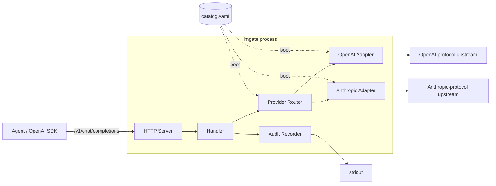
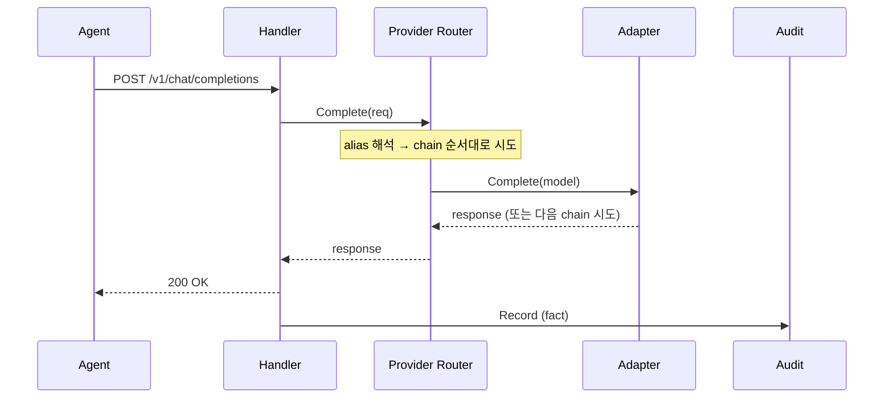

# Architecture

## 정체성

OpenAI SDK 호환 게이트웨이. **logical 모델 이름** 으로 호출하면 우선순위에 따라 자동 폴백한다. DB 없음, fact 만 발행.

## 컴포넌트 구성

| 컴포넌트 | 역할 |
|---|---|
| HTTP Server | OpenAI 와이어 호환 endpoint 노출 |
| Handler | 요청 디코드, stream/non-stream 분기, audit Record 조립 |
| Provider Router | logical 이름 → 모델 chain 해석, 폴백 시도, 회로 차단 |
| OpenAI Adapter | OpenAI 와이어로 upstream 호출 |
| Anthropic Adapter | Anthropic 와이어로 변환 후 호출, OpenAI 와이어로 응답 정규화 |
| Audit Recorder | 요청당 1개 fact record 발행 |

### 부팅 순서

1. env (`.env` 또는 환경변수) 로드
2. `catalog.yaml` 파싱 → 모델 / endpoint / alias / 폴백 정책 확정
3. protocol 별 adapter factory 호출 → Adapter 인스턴스 생성
4. Provider Router 조립 (model → adapter 매핑, alias chain, 회로 초기화)
5. HTTP Server 시작

## 요청 생애주기

스트리밍 요청은 V1 에서 폴백하지 않는다. chain 의 첫 모델이 실패하면 그대로 클라이언트에 에러 전파.

## 상태가 어디 사는가

| 데이터 | 위치 | 수명 |
|---|---|---|
| 모델 / endpoint / alias / 폴백 정책 | `catalog.yaml` (외부) | 외부 갱신 시 재시작 |
| 회로 차단 상태 | Provider Router 메모리 (per-process) | 프로세스 수명 |
| 요청별 시도 이력 | request context | 요청 1회 |
| 감사 record | Sink 가 결정 | Sink 정책 |
| 비용 / 한도 / 카탈로그 단가 | **gateway 가 보관하지 않음** | downstream 책임 |

## 의도적 미지원

`docs/adr/002-out-of-scope.md` 참조. 멀티모달 / multi-key / 캐시 / hot-reload / pre-call 한도 / capability matching — 모두 V1 범위 밖.
