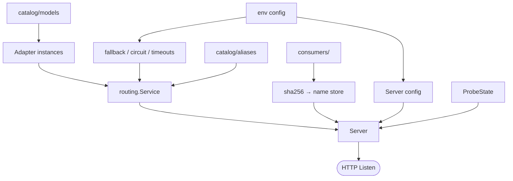
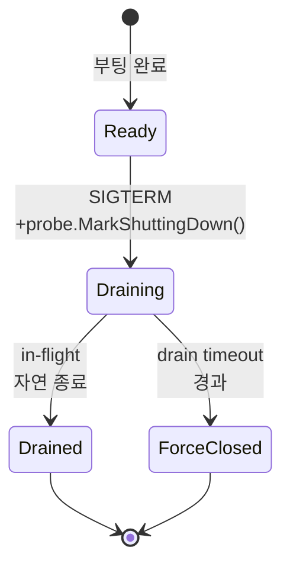

# 부팅 / 프로브 / 셧다운

← [architecture.md](architecture.md) 로 돌아가기

프로세스 한 사이클의 외곽 — 시작 / probes / SIGTERM 드레인.

## 부팅 시퀀스



순서: `cmd/llmgate/main.go` 가 env / config / logger 를 준비한다. `internal/app/gateway` 가
catalog 와 consumers 를 로드하고, catalog 모델을 provider 로 바꿔 `routing.Service` 를 만든다.
이어서 telemetry recorders / llmresult sink / Handler / middleware / ProbeState / HTTP server 를
조립한다. 이후 main 은 signal context 를 만들고 `gateway.Runtime.Run` 이 Listen / graceful
shutdown 을 실행한다.

## 프로브 & 셧다운



엔드포인트 응답 (각 상태에서):

```
                       Ready                Draining / ForceClosed
GET /healthz/live    →  200 ok            →  200 ok               (항상)
GET /healthz/ready   →  200 ready         →  503 shutting_down
GET /healthz         →  200 ready         →  503 shutting_down    (legacy alias)
GET /metrics         →  선택적 scrape endpoint, embedder 가 설정한 경우만
```

프로브와 선택적 `/metrics` 는 business middleware 밖에 둔다. request_id / auth / access log 를
거치지 않으므로 앱 로그는 실제 호출 트래픽에 집중된다.

`LLMGATE_SHUTDOWN_DRAIN_TIMEOUT` (디폴트 5m) 이 drain 의 상한. 오케스트레이터의
`terminationGracePeriodSeconds` (k8s) / `stop_grace_period` (compose) 를 이 값보다 살짝 크게
잡아 SIGKILL 이전에 앱 단 force close 가 먼저 발화하게 한다. preStop `sleep` 으로
endpoint propagation lag 를 깔면 readiness flip 과 신규 트래픽 차단 사이의 race 가 줄어든다.
