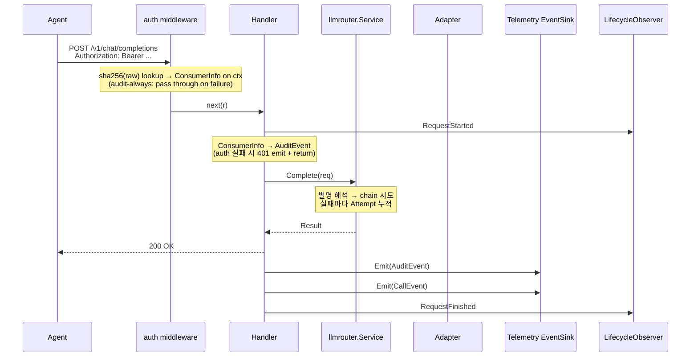

# 요청 생애주기 + 스트리밍 폴백 경계

← [architecture.md](architecture.md) 로 돌아가기

요청 1 회가 어떤 컴포넌트를 어떤 순서로 거쳐 `AuditEvent` 와 `CallEvent` 로 끝나는가.

## 요청 생애주기



`AuditEvent` 는 요청당 1 행이다. auth 실패, bad request, panic 도 남긴다. `CallEvent` 는
LLM 호출이 시도된 요청만 남긴다 — vendor 호출 전 끝난 요청은 운영 / 보안 증적으로 충분하므로
call event stream 을 오염시키지 않는다.

## 스트리밍 폴백 경계

```
Time ───────────────────────────────────────────────────────────────►

   ┌── status open ──┐    ┌── first event ──┐    ┌── mid-stream ────────┐
   │ HTTP status     │    │ 첫 chunk 검증    │    │ Recv 루프 / idle /   │
   │ 분류 (adapter)  │    │ (adapter)       │    │ [DONE] (responder)   │
   └────────┬────────┘    └─────────┬───────┘    └──────────┬───────────┘
            │                       │                       │
        ✅ fallback              ✅ fallback              ❌ no fallback
        (llmrouter.Service)      (llmrouter.Service)      SSE error frame
                                                          + [DONE], 종결

   ◄────────── 폴백 가능 영역 ──────────►◄────── 폴백 불가 ──────►
```

`llmrouter.Service` 는 status open / first event 단계의 실패만 받는다 — 와이어 분류는
adapter 가 끝낸 상태이므로 폴백 적격 판정 ([ADR 004](adr/004-fallback-policy.md)) 을
non-stream 과 같은 규칙으로 적용. 스트림 시작에 별도 timeout 을 만들지 않고 Handler 의
request context 를 그대로 넘긴다 ([ADR 005](adr/005-timeout-authority.md)) — 시작 / 첫 이벤트 /
전송 전체가 `LLMGATE_REQUEST_TIMEOUT` 하나를 공유.

Handler 가 200 OK 를 커밋한 뒤에는 streamRelay 가 SSE 전송. 이벤트 사이 idle 은
`LLMGATE_STREAM_IDLE_TIMEOUT`, end-of-stream 에서 `Stream.Summary()` 로 usage / finish
reason 을 `CallEvent` 에 finalize. streaming 구간의 live gauge 는 `LifecycleObserver` 가
`StreamStarted` / `StreamFinished` 로 받는다. mid-stream 폴백 거부 근거 (HTTP 시맨틱 / SDK
호환 / event 무결성) 는 [ADR 004](adr/004-fallback-policy.md).

## telemetry delivery boundary

Handler 는 audit / call 을 별도 recorder 에 직접 쓰지 않고 `telemetry.EventSink` 로 finalized
event 를 emit 한다. 기본 wiring 은 `SlogSink` 가 audit / call 로그 라인을 stdout 으로 라우팅한다.
이 경계는 추후 messaging stream sink 를 추가해도 요청 처리 코드가 바뀌지 않도록 둔 것이다.

sink 와 lifecycle observer 는 panic isolation 으로 감싸진다. 로그 / 관측 sink 의 결함이 API 응답
경로를 깨지 않아야 하기 때문이다. 단, 원격 messaging sink 는 별도 bounded async queue / drop
policy 를 가진 sink 로 붙인다 — 네트워크 backpressure 를 Handler defer 안으로 끌어오지 않는다.

## llmresult boundary

학습 / 분석용 이벤트의 payload 는 `telemetry` 가 아니라 `internal/domain/llmresult` 에 둔다.
non-stream 은 upstream 이 돌려준 최종 `Response` 를 그대로 쓸 수 있지만, stream 은 SSE chunk 의
`delta` 를 이어 붙여 같은 OpenAI-shaped `Response` 로 복원해야 한다. NATS 같은 원격 sink 는 이
완성된 payload 뒤에 붙는다.

Handler 는 요청 종료 시점에 finalized `AuditEvent` / `CallEvent` 와 원본 request / 최종 response 를
묶어 `llmresult.Event` 를 만든다. 기본 `ResultSink` 는 no-op 이므로 원격 sink 를 설정하지 않으면
기존 HTTP 응답과 운영 telemetry 동작은 그대로 유지된다.

원격 publish 는 `internal/domain/llmresult/sink.AsyncSink` 뒤에 붙인다. Handler 의 `Emit` 은
bounded queue 에 넣는 데서 끝나고, queue 가 가득 차면 요청을 막지 않고 drop 한다.
worker 는 이벤트를 메모리 batch 로 모아 `LLMGATE_LLMRESULT_ASYNC_BATCH_SIZE` 개가 되거나
`LLMGATE_LLMRESULT_ASYNC_FLUSH_INTERVAL` 이 지나면 flush 한다. `Close()` 때는 남은 batch 를
drain 한 뒤 원격 sink 를 닫는다.
NATS publisher 는 queue worker 뒤에서 finalized event 를 JSON 으로 인코딩한다.
`LLMGATE_LLMRESULT_NATS_URL` 이 비어 있으면 기본 sink 는 no-op 이고, 설정되면 JetStream stream 을
확인 / 생성한 뒤 publish 한다.
